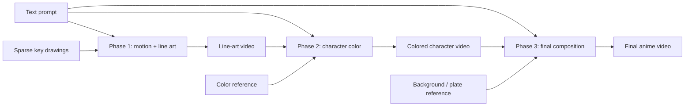

# Pipeline-Aware Anime Text-to-Video

This project generates short anime shots by following the structure of an animation
production pipeline instead of asking one model to produce the final video in a single
step.

A text prompt guides all three phases. Visual controls carry timing, identity, and scene
continuity from one phase to the next:

```text
prompt + key drawings
        |
        v
1. motion and line art
        |
        v
2. character color
        |
        v
3. final composition
```

The current implementation fine-tunes a Diffusers-compatible Wan VACE checkpoint with
LoRA on AnitaDataset production stages. VACE is a natural fit because it already accepts a
control video, a generation mask, optional reference images, and text.

## Three-phase showcase

[](docs/assets/readme-showcase-hero-dance-128a.mp4)

**[Play the 7.75-second MP4](docs/assets/readme-showcase-hero-dance-128a.mp4)**

Each scene is shown as synchronized Phase 1, 2, and 3 output. `hero/213_a` and
`dance/221_a` are held-out, reference-conditioned examples. `embrace_freedom/128_a`
demonstrates the more difficult prompt-only extrapolation for phases 2 and 3, because that
shot has no paired color or composition records.

The showcase uses `wan21-vace-1.3b-anita-480p-r1` at step 1500 with 30 inference steps and
CFG 5.0. Source renders are 832x480 at 12 fps. Labels, scaling, fades, and layout are the
only post-processing.

## Why pipeline-aware generation?

Single-pass generation must solve motion, drawing consistency, character color,
background design, lighting, and compositing simultaneously. Breaking the task into
production-aware phases gives each transformation a clearer contract:

- timing and motion can be reviewed before color or rendering;
- character identity and palette can be stabilized with a reference drawing;
- backgrounds and lighting can change without asking the model to rediscover the motion;
- failures are attributable to a phase instead of being hidden in one final sample;
- artists can replace, edit, or approve intermediate videos.

Text remains important, but it works with the intermediate representation rather than
being the only source of control.

## Phase 1 - Motion and line art

Phase 1 turns sparse line-art keys into a complete line-art shot.

| Input | Behavior |
|---|---|
| Text prompt | Describes subject, action, framing, and intended motion. |
| Control video | Contains line-art key drawings at selected frames and neutral gray elsewhere. |
| VACE mask | `0` on supplied keys and `1` on frames to generate. |
| Output | A continuous clean line-art sequence. |

Anita frame numbers are interpreted as timing-sheet positions on a 24 fps timeline. Missing
numbers become held drawings instead of being discarded. The default training setup samples
every second timeline frame, producing 12 fps while preserving anime exposure timing.

The current checkpoint is strongest at in-betweening supplied keys. Fully prompt-only line
art generation is a future extension, not the primary trained contract.

## Phase 2 - Character color

Phase 2 colors the animated character while preserving Phase 1 motion and line work.

| Input | Behavior |
|---|---|
| Text prompt | Describes palette, clothing, hair, skin, and color treatment. |
| Control video | The complete Phase 1 line-art shot. |
| VACE mask | `1` across the shot so the model transforms the control. |
| Color reference | Normally a colored drawing from outside the sampled window. |
| Output | A character-colored animation layer, usually on a plain background. |

The reference image is the main identity and palette anchor. Prompt-only colorization is
possible as an extrapolation, but it is less stable and can drift in shading or saturation.

## Phase 3 - Final composition

Phase 3 integrates the colored character into the scene and applies the final visual
treatment.

| Input | Behavior |
|---|---|
| Text prompt | Describes setting, lighting, mood, effects, and finished appearance. |
| Control video | The Phase 2 character layer placed over a recovered background. |
| VACE mask | `1` across the shot for full compositing/refinement. |
| Scene reference | A clean background plate for static shots when available. |
| Output | The final composited anime shot. |

Background plates are recovered from Anita's transparent character-color layers and final
compositions. Static shots use a temporal median plate; moving shots use per-frame
backgrounds with character holes filled by multiscale interpolation.

Without a background reference, the phase can still follow a scene prompt, but composition
and color intensity become less predictable. The prompt-only `128_a` panel in the showcase
is intentionally retained as an example of that limitation.

## Architecture



All three phases share one VACE LoRA. Task-specific prompts and conditioning layouts tell
the model which transformation to perform. Training uses the pipeline's own
`prepare_video_latents` and `prepare_masks` methods so training and stock
`WanVACEPipeline` inference see the same representation.

## Data contract

The expected Anita layout is:

```text
anita/
└── work/
    ├── sketch/scene/*.png
    ├── color/scene/*.png
    └── composition/scene/*.png
```

Frames are aligned by filename stem. The available intersections determine which phases a
shot can supervise:

- sketch frames train Phase 1;
- matching sketch + color frames train Phase 2;
- matching color + composition frames train Phase 3.

Whole shots - not individual task records - are assigned to training or validation. This
keeps the same motion from leaking between splits.

## Installation

```bash
python -m venv .venv
source .venv/bin/activate
pip install -e ".[video]"
export HF_HOME=/data/shasegawa/t2a/hf-cache
accelerate config
```

The pipeline also requires CUDA, `ffmpeg`, and enough storage for the base checkpoint,
AnitaDataset, background plates, LoRA checkpoints, and renders.

The default external layout is:

```text
/data/shasegawa/t2a/
├── models/
├── datasets/anita/
├── manifests/
└── outputs/
```

## Prepare the three-phase dataset

Download and extract AnitaDataset:

```bash
scripts/download_anita.sh
unzip -q /data/shasegawa/t2a/datasets/anita/raw/Anita_Dataset.zip \
  -d /data/shasegawa/t2a/datasets/anita
```

Build the aligned production-shot manifest:

```bash
t2a-anita-production manifest \
  --root /data/shasegawa/t2a/datasets/anita \
  --output /data/shasegawa/t2a/manifests/anita_production.jsonl \
  --max-frames-per-shot 49 \
  --min-frames-per-shot 8 \
  --shot-split-strategy semantic
```

Optionally add shot captions with a local VLM or the OpenAI Responses API:

```bash
t2a-caption-anita-shots \
  --input /data/shasegawa/t2a/manifests/anita_production.jsonl \
  --output /data/shasegawa/t2a/manifests/anita_production_captioned.jsonl \
  --provider openai \
  --model gpt-5.6 \
  --num-frames 3 \
  --image-detail low
```

Captioning sends representative frames to the selected provider. Use it only when the data
policy permits. For local-only captioning, use `--provider local --model-path /path/to/vlm`.

Recover the Phase 3 background controls:

```bash
t2a-anita-bg-plates
```

This writes per-shot plates/backgrounds plus
`/data/shasegawa/t2a/manifests/anita_background_plates.jsonl`.

## Train the pipeline-aware LoRA

Download the iteration checkpoint:

```bash
scripts/download_wan21_vace.sh 1.3B
```

Launch the checked-in three-phase configuration:

```bash
CUDA_VISIBLE_DEVICES=0,2,3 NCCL_P2P_DISABLE=1 \
  accelerate launch --num_processes 3 --mixed_precision bf16 \
  -m text_to_anime.train_wan_vace_anita \
  --config configs/wan21_vace_1.3b_anita_480p_lora.yaml
```

The configuration trains a rank-32 LoRA across VACE attention and feed-forward projections.
Task-balanced sampling prevents the more common in-betweening records from overwhelming
color and composition. Changed regions receive higher flow-matching loss weight so the
model is discouraged from copying its control video unchanged.

The documented host has produced silent zero tensors during direct GPU peer copies. Keep
`NCCL_P2P_DISABLE=1` for multi-GPU work until peer-transfer correctness is explicitly
verified.

## Render all three phases

Render held-out records using the exact phase definitions from training:

```bash
t2a-render-wan-vace-anita \
  --config configs/wan21_vace_1.3b_anita_480p_lora.yaml \
  --lora /data/shasegawa/t2a/outputs/wan21-vace-1.3b-anita-480p-r1 \
  --output-dir /data/shasegawa/t2a/outputs/renders/vace-r1-val \
  --device cuda:0
```

Omit `--lora` to produce a base-model baseline. Restrict rendering with `--tasks`,
`--scenes`, or `--max-samples`.

The renderer writes:

- the generated video for each phase;
- control/generated/target comparison videos;
- color-reference images when used;
- per-shot JSON with prompts, frame IDs, and metrics;
- `render_summary.json` for the complete render set.

## Evaluation

Validation holds out whole shots and uses fixed windows, noise, and scheduler timesteps.
Training writes per-phase losses to `validation_log.jsonl`.

Render-time checks include:

- generated-versus-target PSNR;
- generated-versus-control PSNR to detect input copying;
- saturation change, especially for color and composition;
- temporal frame-difference motion;
- synchronized visual review of all three phases.

Review each phase independently before chaining it into the next. A visually plausible
final video can hide a failed intermediate transformation.

## Current limitations

- Phase 1 currently assumes sparse line-art keys; pure text-to-line-art video is not yet the
  primary training task.
- Phase 2 is most reliable with a color reference.
- Phase 3 is most reliable with recovered background context or a clean plate.
- Prompt-only phase extrapolation can overexpose or oversaturate the result.
- Anita captions improve content guidance, but Anita primarily teaches production-stage
  transformations rather than open-domain semantics.
- LoRA checkpoints do not currently include resumable optimizer/scheduler state.
- Metrics are diagnostic; final animation quality still requires human review.

## Repository map

| Area | Files |
|---|---|
| Three-phase sample construction and training | `src/text_to_anime/train_wan_vace_anita.py` |
| Three-phase rendering | `src/text_to_anime/render_wan_vace_anita.py` |
| Anita stage alignment and shot splitting | `src/text_to_anime/anita_production.py` |
| Shot captioning | `src/text_to_anime/caption_anita.py` |
| Background recovery | `src/text_to_anime/anita_bg_plates.py` |
| Active training configuration | `configs/wan21_vace_1.3b_anita_480p_lora.yaml` |

## Documentation

- [Detailed architecture](docs/architecture.md)
- [Training methodology](docs/training-methodology.md)
- [Future direction](docs/future-direction.md)
- [Takeover guide](docs/takeover/README.md)
- [Operations runbook](docs/takeover/runbook.md)
- [Current-state inventory](docs/takeover/current-state.md)

## Data rights

Keep dataset licensing and provenance separate from model quality. Do not use source
material for commercial training or deployment unless the required rights are documented.
