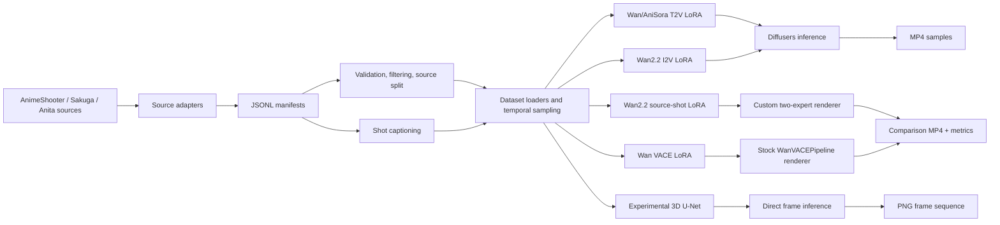

# Architecture

## System purpose

`text-to-anime` turns licensed or otherwise approved anime data into JSONL manifests,
adapts Wan-family video models with LoRA, and renders deterministic evaluation samples.
The intended unit of work is a short shot: one character/background, one continuous
action, and one camera instruction over roughly 3–5 seconds.

The repository is a `src`-layout Python 3.10+ package. `pyproject.toml` declares console
entry points; YAML files under `configs/` provide experiment defaults; shell scripts under
`scripts/` acquire external assets or launch common workflows. Large models, datasets,
manifests, and outputs live outside the repository, conventionally under
`/data/shasegawa/t2a`.

## End-to-end topology



## Runtime and storage boundaries

The repository contains code and small configuration only. `configs/paths.yaml` documents
the expected external layout:

```text
/data/shasegawa/t2a/
├── models/                 # native and Diffusers checkpoints
├── hf-cache/               # Hugging Face cache
├── datasets/               # raw videos, clips, and Anita image sequences
├── manifests/              # generated JSONL indexes and splits
└── outputs/                # LoRAs, logs, validation videos, renders
```

Most CLI defaults are absolute paths into that tree. `T2A_ROOT` is honored by several
shell scripts, but not consistently by Python configurations. Moving the runtime root
therefore requires updating config files or passing explicit CLI arguments.

## Shared data model

### General video records

The generic trainers consume one JSON object per line. The minimal T2V record is:

```json
{
  "video_path": "/absolute/path/to/clip.mp4",
  "caption": "A girl turns toward the classroom window.",
  "source_id": "series-or-source-video"
}
```

Optional fields include structured caption parts, dimensions, duration, aesthetic and
motion scores, OCR/text probability, content category, clip boundaries, and source
metadata. `captioning.build_caption` prefers an existing `caption`; otherwise it joins
`subject`, `appearance`, `initial_state`, `action`, `secondary_motion`, `camera`,
`background`, and `style`. It may append aesthetic/motion scores and a no-text clause.

I2V Anita records use `frame_dir` rather than `video_path`. The first sampled frame is
both target frame zero and the conditioning image.

### Anita production records

`anita_production.build_production_samples` aligns frames by filename stem across the
official layout `work/{sketch,color,composition}/scene/*.png` (and a secondary custom
layout). Each record has:

- `task`: `line_art`, `character_color`, or `compose_refine`;
- `primary_paths`: previous-stage source shot, empty for line art;
- `target_paths`: desired output sequence;
- `reference_paths`: candidate still references;
- `mask_paths`: foreground-mask source images;
- `work`, `scene`, `parent_scene`, `frame_ids`, and sub-shot metadata;
- `prompt`, optionally augmented later with `caption` and VLM provenance.

Long scenes can be split by frame count or by a lightweight semantic boundary detector.
The semantic detector combines a 16×16 grayscale structure feature with per-channel color
histograms, searches near balanced boundaries, and falls back to balanced chunks when the
signal is absent or flat.

### VACE source records

The VACE path builds records in memory from Anita rather than using the production JSONL
as its principal sample index. It reconstructs a 24 fps timing-sheet timeline from frame
numbers, preserving held drawings, then samples it at `timeline_stride` (2 by default,
equivalent to 12 fps). It also joins optional captions and a background-plate index.

## Data ingestion and preparation components

| Module | Responsibility |
|---|---|
| `animeshooter.py` | Reads zipped or unpacked annotations, extracts native descriptive captions and shot boundaries, and writes clip records. |
| `sakuga.py` | Normalizes Parquet/JSONL metadata with flexible source, path, caption, tag, and score keys. |
| `anita.py` | Indexes Anita image-sequence folders and optionally renders them to MP4. |
| `extract_clips.py` | Invokes `ffmpeg` for manifest-defined shot extraction. |
| `frames.py` | Extracts a selected video frame and adds its path to a manifest. |
| `manifest.py` | JSONL I/O, normalization, validation, and deterministic source-group splitting. |
| `subset.py` | Scores quality, infers motion/content category, enforces source caps, and builds a VN-weighted subset. |
| `caption_anita.py` | Captions a shot from representative frames with either a local VLM or the OpenAI Responses API. |
| `anita_bg_plates.py` | Recovers static plates or per-frame backgrounds from RGBA character layers and final compositions. |

`video.py` is the shared decoder/sampler. It prefers Decord and falls back to TorchVision,
selects a contiguous window when enough frames exist, linearly repeats/interpolates index
positions for short clips, cover-resizes, crops, normalizes to `[-1, 1]`, and returns
`C×T×H×W`. Repeated anime frames are intentionally retained. Wan frame counts must satisfy
`T = 4k + 1`.

## Model and training paths

### 1. Generic text-to-video

Entry point: `t2a-train-wan-lora` (`train_wan_lora.py`).

The loader reads MP4 clips and captions. `WanPipeline` supplies the frozen VAE, tokenizer,
text encoder, scheduler, and one or two transformers. Only LoRA adapters on the selected
transformer are trainable. Wan2.2 high- and low-noise transformers are trained in separate
runs selected by `train_stage`.

Output is a Diffusers LoRA directory with `training_args.json`, `training_metadata.json`,
and periodic `checkpoint-N` LoRA snapshots. `t2a-infer-wan` loads these through
`WanPipeline`.

### 2. First-frame image-to-video

Entry point: `t2a-train-wan-i2v-lora` (`train_wan_i2v_lora.py`).

The target is an Anita frame sequence. Frame zero is VAE-encoded as a video with zeros in
later frames. A temporal mask marks only the known first frame. Mask and condition latents
are concatenated to noisy target latents exactly in the channel layout expected by
`WanImageToVideoPipeline`. The image encoder, if present, is frozen and is not used in the
transformer call; conditioning is latent-video based.

`t2a-infer-wan-i2v` is the single-sample inference path; `batch_infer_wan_i2v.py` handles
manifest-driven batches. `anisora_i2v_web.py` is a small standard-library HTTP job server
that shells out to the native AniSora inference program and serializes GPU work with a
process-local lock.

### 3. Wan2.2 source-shot production LoRA

Entry point: `t2a-train-wan22-anita-production`.

The three tasks share one adapter per Wan expert. For color and compose tasks, the entire
previous-stage video is VAE-encoded and paired with a full condition mask. Line art can use
a first frame, still reference, or no condition. Balanced sampling can neutralize task
record-count imbalance and then apply an explicit task mixture.

Wan2.2 A14B uses high- and low-noise experts. Each adapter is trained independently, then
`t2a-render-wan22-anita-production` loads both and switches experts at the checkpoint's
`boundary_ratio`. The custom renderer exists because stock I2V inference exposes initial/
last images, not arbitrary source-shot latent conditioning. It supports teacher forcing or
`--chain`, emits condition/generated/target panels, and computes copy-detection, motion,
and saturation metrics.

### 4. VACE-native Anita production LoRA

Entry point: `t2a-train-wan-vace-anita`.

This is the most production-aligned implementation in the repository because every task
is expressed using VACE's pretrained control-video, generate-mask, and reference-image
interfaces:

| Task | Control | Generate mask | Optional reference | Target |
|---|---|---|---|---|
| `inbetween` | sparse line-art keys, gray elsewhere | 0 at keyframes, 1 elsewhere | none | full line art |
| `character_color` | full line-art sequence | 1 | colored drawing outside the sampled window | colored character layer |
| `compose_refine` | character layer over recovered background | 1 | clean static plate | final composition |

Condition tensors are constructed by `WanVACEPipeline.prepare_video_latents` and
`prepare_masks`, keeping training and stock-pipeline inference aligned. Clip length varies
by shot, so batch size is fixed at one and scale comes from gradient accumulation and data
parallel workers. `t2a-render-wan-vace-anita` reuses the same sample builder for held-out
renders.

### 5. Experimental standalone 3D U-Net

Entry point: `t2a-train-anita-production` in `anita_production.py`.

This model takes 12 condition channels: source RGB, first-frame RGB, reference RGB, and a
presence flag for each. A hash-token text embedding and learned task embedding modulate
3D residual blocks. It is trained end-to-end with supervised image, temporal-delta, and
line-art edge losses. It does not use Wan weights, diffusion, or LoRA, and should be treated
as a baseline rather than a drop-in production renderer.

## Inference and evaluation architecture

Generic T2V/I2V uses Diffusers pipelines and UniPC scheduling. Production rendering adds
task-aware evaluation:

- teacher-forced mode isolates whether a task adapter learned its mapping;
- chained mode exposes accumulated error across line art → color → composition;
- PSNR generated-vs-target measures fidelity;
- generated-vs-condition compared with condition-vs-target detects input copying;
- mean saturation identifies failure to add color;
- frame-difference motion identifies frozen or unstable outputs;
- side-by-side videos make qualitative inspection reproducible.

VACE validation during training uses fixed shot windows, fixed seeds, and scheduler probes
near timesteps 250, 500, and 750. Results are appended by task to
`validation_log.jsonl`. Render-time metrics are written to per-sample JSON and a summary.

## Configuration and dependency flow

Trainers parse `--config` first, load YAML/JSON into parser defaults, then allow explicit
CLI arguments to override those defaults. Accelerate owns distributed preparation,
gradient synchronization, and mixed precision for all LoRA trainers. PEFT inserts LoRA;
Diffusers loads/saves pipeline-compatible weights; Torch handles datasets and optimization.

The main external executables/services are:

- `ffmpeg` for clip extraction and MP4 encoding;
- Hugging Face Hub for model/dataset downloads;
- Google Drive (`gdown`) for Anita acquisition;
- optional OpenAI Responses API for captioning;
- CUDA/NCCL and Accelerate for training.

## Module ownership map

| Area | Primary source files |
|---|---|
| Common records/captions/video | `manifest.py`, `captioning.py`, `video.py` |
| Dataset adapters | `animeshooter.py`, `sakuga.py`, `anita.py`, `subset.py` |
| Production data | `anita_production.py`, `caption_anita.py`, `anita_bg_plates.py` |
| Generic T2V | `train_wan_lora.py`, `infer_wan.py` |
| First-frame I2V | `train_wan_i2v_lora.py`, `infer_wan_i2v.py`, `batch_infer_wan_i2v.py` |
| Wan2.2 production | `train_wan22_anita_production_lora.py`, `render_wan22_anita_production.py` |
| VACE production | `train_wan_vace_anita.py`, `render_wan_vace_anita.py` |
| Native AniSora web wrapper | `anisora_i2v_web.py` |

## Important design constraints

- Do not remove held/repeated frames; they encode anime timing.
- Split by source video or whole Anita shot, never random neighboring clips.
- T2V and source-shot trainers require Wan-compatible `4k+1` frame counts.
- Wan2.2 high and low LoRAs are not interchangeable; record which expert each adapter
  targets.
- The source-shot renderer routes CUDA-to-CUDA transfers through CPU because direct peer
  copies on the documented host silently produced zeros. Multi-GPU commands set
  `NCCL_P2P_DISABLE=1` for the same reason.
- The native AniSora checkpoint and a Diffusers-converted checkpoint are different assets.
  LoRA trainers require the Diffusers layout.
- Dataset licensing and provenance are operational requirements. The code does not enforce
  rights clearance.
